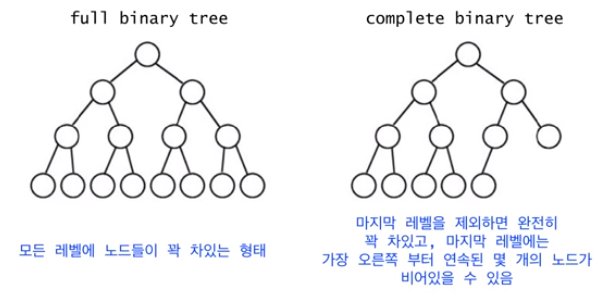
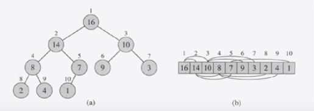

### Heap Sort

- Merge Sort와 달리 정렬에 추가 배열이 불필요
- 이진 힙 (Binary heap) 자료 구조 이용

*최악의 경우 시간복잡도 O(nlogn)*

---

**Heap** 은
1) *complete binary tree* 이면서
2) *heap property* 를 만족해야 한다.

> 
*Full vs Complete Binary Tree*

Tree는 위의 그림과 같이 계층적 관계를 표현하기 위해 사용된다. Tree에서 *Root node* 는 유일하며 최상단에 위치하며 부모가 존재하지 않는 노드이고, *Leaf node* 는 자식이 존재하지 않는 노드이다.

Binary tree는 최대 두 개의 자식을 가지는 tree이다.

> Heap property

* max heap propert : 부모는 자식보다 크거나 같다
* min heap property : 부모는 자식보다 작거나 같다

> Heap은 1차원 배열로 표현 가능
: A[1..n]



* Root Node : A[1]
* A[i]의 부모 = A[i/2]
* A[i]의 왼쪽 자식 = A[2i]
* A[i]의 오른쪽 자식 = A[2i+1]

**Complete binary tree** 라면, 1차원 배열에 저장된 Heap의 원소들 간의 부모-자식 관계를 index 값을 통해 알 수 있다

---

> example code

1. 주어진 데이터로 Heap을 만든다
2. Heap에서 최대값 (Root) 을 가장 마지막 값과 바꾼다
3. Heap의 크기가 1 줄어든 것으로 간주한다. 즉, 가장 마지막 값은 힙의 일부가 아닌 것으로 간주한다
4. Root node에 대하여 Heapify(1)한다
5. 2-4번을 반복한다

```
public class HeapSort {
  public void sort(int[] arr) {
    int size = arr.length;

    // step 1. build a heap
    for (int i = size / 2 - 1; i >= 0; i--) {
      heapify(arr, size, i);
    }

    // step 2. replace the largest with the last element
    // step 3. and assume the size of array reduced by 1
    for (int i = size - 1; i >= 0; i--) {
      // arr[0] is a root and is the largest of the heap
      // step 4. heapify(1) for the root node
      int tmp = arr[0];
      arr[0] = arr[i];
      arr[i] = tmp;

      // call max heapify on the reduced heap
      heapify(arr, i, 0);
    }

  }

  public void heapify(int[] arr, int heapSize, int i) {
    int largest = i;  // initialize largest as root node
    int leftChildIdx = 2 * i + 1;
    int rightChildIdx = 2 * i + 2;

    // if left > root
    if (leftChildIdx < heapSize && arr[leftChildIdx] > arr[largest]) {
      largest = leftChildIdx;
    }

    // if right > largest
    if (rightChildIdx < heapSize && arr[rightChildIdx] > arr[largest]) {
      largest = rightChildIdx;
    }

    // if largest is not root
    if (largest != i) {
      int swap = arr[i];
      arr[i] = arr[largest];
      arr[largest] = swap;

      // recursive call to heapify the sub-tree
      heapify(arr, heapSize, largest);
    }
  }
}
```
