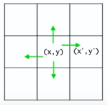

## Recursion Advanced

> Q1. 미로찾기

*Recursive Thinking*

현재 위치에서 출구까지 가는 경로가 있으려면
- 현재 위치가 출구이거나 혹은
- 이웃한 셀들 중 하나에서 현재 위치를 지나지 않고 출구까지 가는 경로가 있다

1-1) Decision problem (답이 Y/N인 문제)



현재 위치를 (x,y), 인접한 셀들의 좌표를 (x',y')라고 하면

```
boolean findPath(x,y) {
  if (x,y) is either on the wall or a visited cell
    return false;
  else if (x,y) is the exit
    return true;
  else
    mark (x,y) as a visited cell;
    for each neighboring cell (x',y') of (x,y) do
      if (x',y') is on the pathway and **not visited**
        if findPath(x',y')
          return true;
    return false;
}

```

---

```
public class Maze {
  private static int N=8;
  private static int [][] maze = {
    {0, 0, 0, 0, 0, 0, 0, 1},
    {0, 1, 1, 0, 1 ,1, 0, 1},
    {0, 0, 0, 1, 0, 0, 0, 1},
    {0, 1, 0, 0, 1, 1, 0, 0},
    {0, 1, 1, 1, 0, 0, 1, 1},
    {0, 1, 0, 0, 0, 1, 0, 1},
    {0, 0, 0, 1, 0, 0, 0, 1},
    {0, 1, 1, 1, 0, 1, 0, 0}
  }

  private static final int PATHWAY_COLOUR = 0;
  private static final int WALL_COLOUR = 1;     // 벽일 때, 즉 통로가 아닐 때
  private static final int BLOCKED_COLOUR = 2;  // visited이며 출구까지의 경로상에 있지 않음이 밝혀진 cell
  private static final int PATH_COLOUR = 3;     // visited이며 아직 출구로 가는 경로가 될 가능성이 있는 cell
}
```


```
public static boolean findMazePath(int x, int y) {
  if (x<0 || y<0 || x>=N || y>=N) {
    return false;
  } else if (maze[x][y] != PATHWAY_COLOUR) {
    return false;
  } else {
    maze[x][y] = PATH_COLOUR;
    if (findMazePath(x-1,y) || findMazePath(x,y+1) || findMazePath(x+1,y) || findMazePath(x,y-1)) {
      return true;
    }
    maze[x][y] = BLOCKED_COLOUR;  // dead end
    return false;
  }
}

public static void main(String[] args) {
  findMazePath(0, 0); // 원점에서부터 시작
}
```
