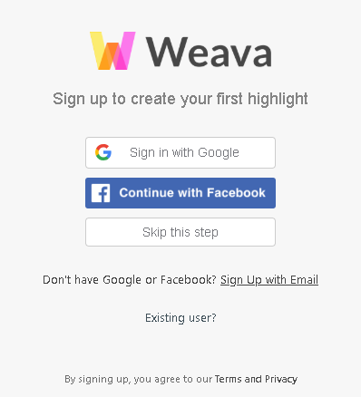
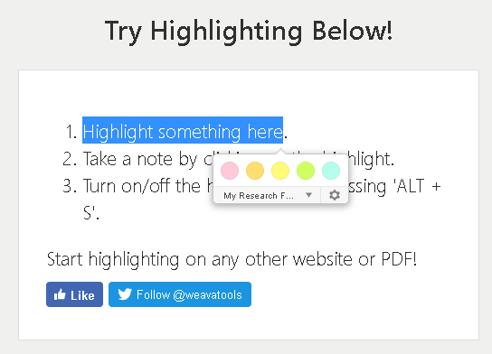

# Useful tools

### Chrome extensions

> **Weava Highlighter**

*웹 페이지 내의 필요한 정보를 아카이빙하고자 할 때 유용한 브라우저 확장 프로그램*

- 설치하기 @[Chrome Web Store](https://chrome.google.com/webstore/detail/weava-highlighter-pdf-web/cbnaodkpfinfiipjblikofhlhlcickei)

- 계정생성/연동

- 이렇게 씁니다

아카이빙 하고 싶은 구절을 드래그!

Setting에서 컬러 별로 구분하여 보관할 수 있다! 😀

> **Stylish**

*Custom CSS를 통해 웹 사이트들의 theme를 바꾸는 브라우저 확장 프로그램*

- 설치하기 @[Chrome Web Store](https://chrome.google.com/webstore/detail/stylish-custom-themes-for/fjnbnpbmkenffdnngjfgmeleoegfcffe)

- Theme 적용하기 @[stylish](https://userstyles.org/)
  - facebook, google, youtube 등 다양한 사이트에 대한 theme가 있다.
